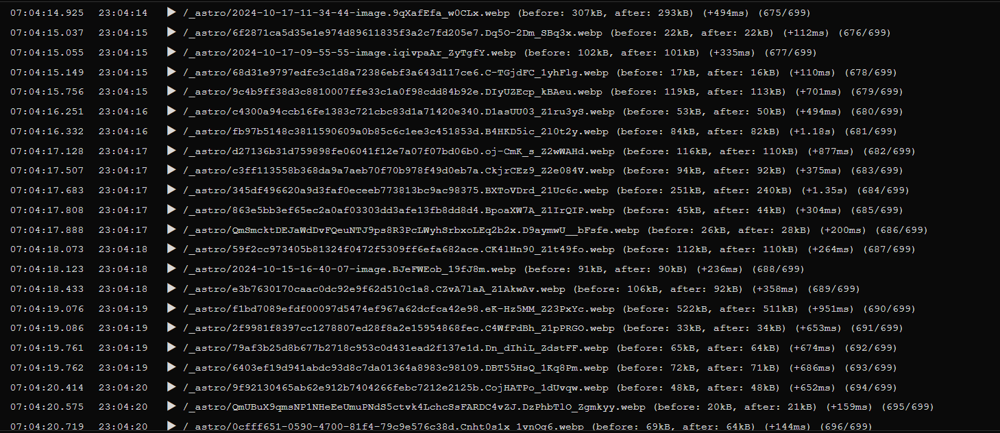
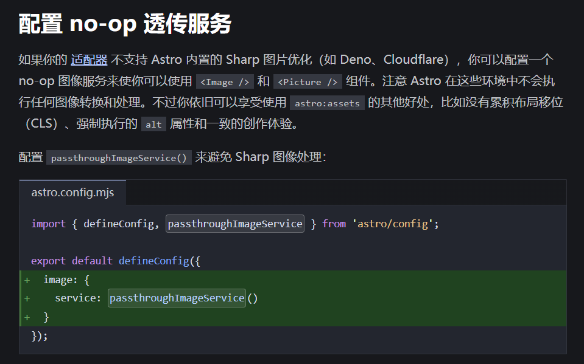

# 为什么要禁用图片优化？

下图是一个默认的Astro静态构建，也就是 `astro build` 的输出，输出中记录了每张图片是如何被Astro “优化” 的。我们不难发现问题所在：

压缩效果微乎其微，甚至有反向压缩。大部分图片仅压缩了几kb，但是为此需要花费 **100-1000ms** 不等，甚至第12行出现了 `before: 26kb, after: 28kb` 这样的反向压缩

*为什么要浪费这么多的时间来进行±10kb左右的图片压缩呢？*



# 如何让Astro不”优化“图片？

> [图像 | Docs](https://docs.astro.build/zh-cn/guides/images/)

查阅 Astro 文档可知

会被优化的情况：

- 非 `/public` 目录下的图片

- 使用 `<Image />` 等Astro图片组件

- 任何MarkDown内的图片，除非你不走Astro内部的 MarkDown -> HTML 转换

不难发现，我们似乎已经找到了一个折中的解决方案： **将图片放置到 /public 目录**

# 尝试将图片放置到 /public 目录（不完美）

这会遇到一个经典问题，这是我询问 OpenAI ChatGPT 的原话

*我遇到了一个两难的问题 我使用Astro 我的文章在./src/content/posts/xxx.md 我的图片之前在./src/content/assets/images/xxx.png 由于我不想要Astro默认的图片优化，因为构建太慢了，于是我将图片放到了./public/assets/images/xxx.png 然后我将MarkDown引用的图片从 ../assets/images/xxx.png 改为了 ./public/assets/images/xxx.png 但是现在新的问题出现了，我的MarkText（一个MarkDown编辑器）去寻找了 ./src/content/posts/public/assets/images/xxx.png 导致我在编辑器中看不到任何图片 有没有什么好的解决方案？*

如果反其道而行之，使用类似 `../../../assets/images/xxx.png` 会导致部分组件无法获得真实图片，导致 `astro build` 直接报错退出，比如每篇文章开头的 YAML 元数据中的 `image` 字段

**结论：** 该方案并不完美。要不无法即写即看，要不构建失败

# 尝试使用Astro官方提供的配置禁用图片优化（失败）

遇到Astro上的问题，首先就应该查询官方文档了解是否已有解决方案。通过文档查询，我找到了 [图像 | Docs](https://docs.astro.build/zh-cn/guides/images/#%E9%85%8D%E7%BD%AE-no-op-%E9%80%8F%E4%BC%A0%E6%9C%8D%E5%8A%A1) 中的 **配置 no-op 透传服务** ，尝试配置，但是无用，不管是本地运行构建或Cloudflare Worker云端构建，仍然会触发 **generating optimized images** 步骤

*如果您了解如何在Astro的配置层面直接禁用图片优化，请联系我！我很乐意与您交流！*



# 尝试直接更改Astro源码来禁用图片优化（成功）

研究到这，大半天已经过去了，我已经没有精力去研究怎么 **合法** 禁用Astro的图片优化了，不如单刀直入，直接改源码，使用 **非法操作** 吧

大致步骤，直接改Astro包的源码，然后用 `pnpm patch` 为它打个补丁，下面是完整、可用的 `astro.patch` 。全局禁用图片优化

```diff
diff --git a/dist/assets/utils/transformToPath.js b/dist/assets/utils/transformToPath.js
index cca8548dec42090b0621d1f21c86f503d5bba1be..8b0a3cfcea73abc4d63592709bb9ba2b2f83989a 100644
--- a/dist/assets/utils/transformToPath.js
+++ b/dist/assets/utils/transformToPath.js
@@ -13,7 +13,9 @@ function propsToFilename(filePath, transform, hash) {
   }
   const prefixDirname = isESMImportedImage(transform.src) ? dirname(filePath) : "";
   let outputExt = transform.format ? `.${transform.format}` : ext;
-  return decodeURIComponent(`${prefixDirname}/${filename}_${hash}${outputExt}`);
+  
+  // Force disable image optimization - return original path without hash and format conversion
+  return decodeURIComponent(`${prefixDirname}/${filename}${ext}`);
 }
 function hashTransform(transform, imageService, propertiesToHash) {
   const hashFields = propertiesToHash.reduce(
diff --git a/dist/core/build/generate.js b/dist/core/build/generate.js
index 3144f4c058b161b9e6eb3c8d891b743b34783653..0ba275b320204e154307c6aff75452e9dcb2300d 100644
--- a/dist/core/build/generate.js
+++ b/dist/core/build/generate.js
@@ -91,7 +91,8 @@ ${bgGreen(black(` ${verb} static routes `))}`);
 `)
   );
   const staticImageList = getStaticImageList();
-  if (staticImageList.size) {
+  // Force disable image optimization - hardcoded
+  if (false) {
     logger.info("SKIP_FORMAT", `${bgGreen(black(` generating optimized images `))}`);
     const totalCount = Array.from(staticImageList.values()).map((x) => x.transforms.size).reduce((a, b) => a + b, 0);
     const cpuCount = os.cpus().length;
```

下文为我让OpenAI ChatGPT 5解释的已经禁用图片优化的补丁（`astro.patch`）具体做了什么

### 修改点 1：`dist/assets/utils/transformToPath.js`

```diff
-  return decodeURIComponent(`${prefixDirname}/${filename}_${hash}${outputExt}`);
+  
+  // Force disable image optimization - return original path without hash and format conversion
+  return decodeURIComponent(`${prefixDirname}/${filename}${ext}`);
```

#### 原逻辑

- 原本的返回路径是：
  
  ```bash
  {prefixDirname}/{filename}_{hash}.{format or ext}
  ```
  
  - `prefixDirname`：如果图片是通过 ESM import 进来的，会带上所在目录，否则为空。
  
  - `filename`：文件名。
  
  - `hash`：基于图片参数生成的 hash，用于区分不同尺寸/格式。
  
  - `outputExt`：可能是 `webp`、`avif` 等格式。

👉 这样 Astro 会给图片文件生成带 hash 的路径，并且可能修改格式。

#### 修改后逻辑

- 返回路径改成了：

```bash
{prefixDirname}/{filename}{ext}
```

- 直接使用原始扩展名，不带 hash，也不做格式转换。

✅ 作用：完全禁用图片优化的文件名规则，保留原始文件路径。

---

### 修改点 2：`dist/core/build/generate.js`

```diff
-  if (staticImageList.size) {
+  // Force disable image optimization - hardcoded
+  if (false) {
```

#### 原逻辑

- `staticImageList` 存放了 Astro build 时需要优化的所有静态图片。

- 如果有图片，Astro 会启动优化逻辑：
  
  - 打印日志 `"generating optimized images"`
  
  - 遍历 `staticImageList`，并调用 image service 去生成不同尺寸和格式。

#### 修改后逻辑

- 把 `if (staticImageList.size)` 改成了 `if (false)`。

- 这意味着 **Astro 永远不会进入优化图片的流程**。

✅ 作用：强制跳过所有图片优化步骤。

---

### 总结

你的这个 patch 做了两件事：

1. **绕过文件名 hash 和格式转换** → 保证生成的图片路径就是原始路径。

2. **完全禁用构建时图片优化** → Astro build 时不再生成任何衍生格式或多尺寸图片。

等价于 **彻底关闭 Astro 的图片优化功能**，构建出来的就是你原始的图片。

# 最终效果

任何情况下使用 `astro build` 都会跳过图片优化，Cloudflare Worker的构建时间从 3分钟下降到2分钟


构建后的页面不再为全局webp，透传原始文件名、扩展名。但仍然保留了 `/_astro` 路径，依旧支持相对路径粘贴图片


