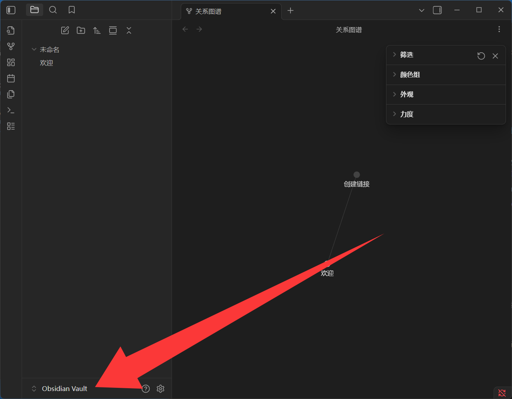
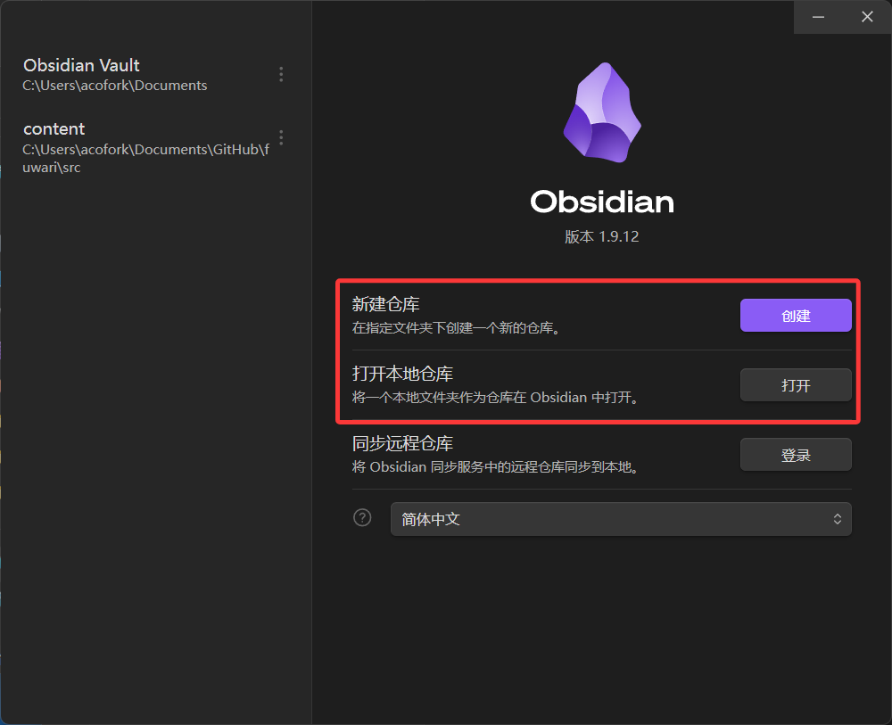
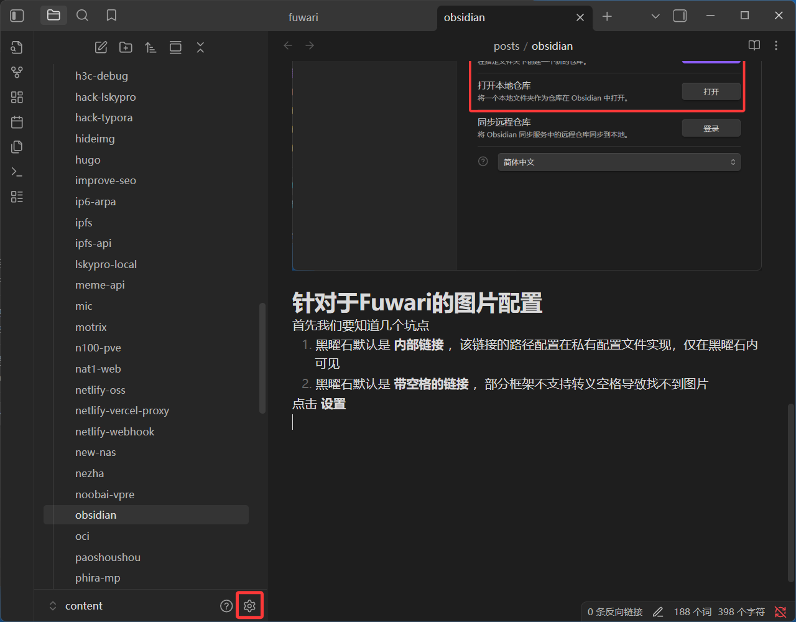
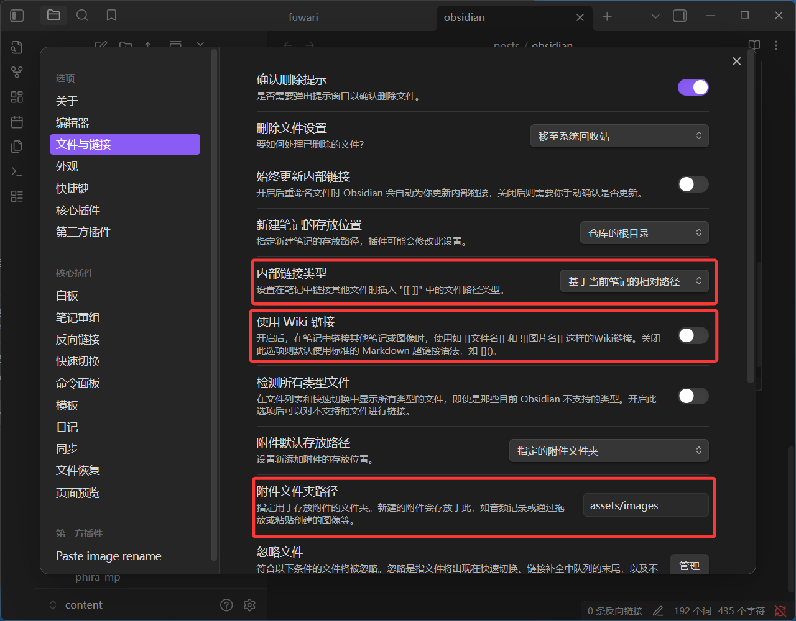
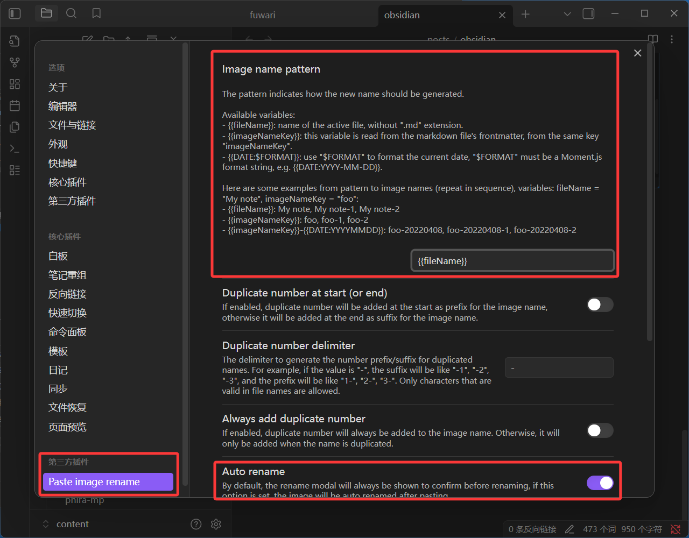
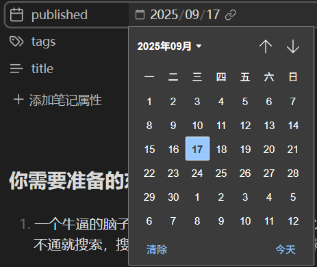
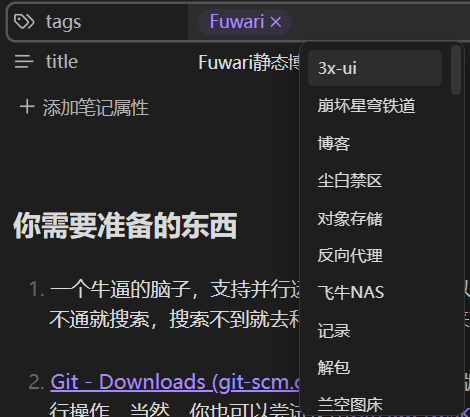
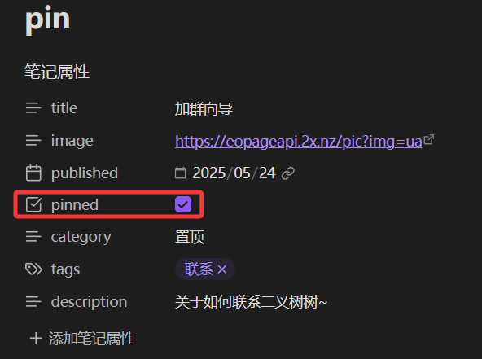

# 下载
前往 [Download - Obsidian](https://obsidian.md/download) 下载对应你系统版本的软件。安装界面就可以选择语言为 **简体中文**
# 初次上手
Obsidian（下文简称“黑曜石”）将每一个存放了多个MarkDown文件的文件夹都叫做 **仓库** 
首先，点击左下角的 **Obsidian  Vault** 

然后点击 **管理仓库** ，然后根据你所需要的情况进行选择

黑曜石会在每个仓库下创建 `.obsidian` ，存放了工作区的配置信息
**注意：** 黑曜石的配置都是针对于单个仓库的，若该配置文件丢失你需要重新配置黑曜石。所以，请确保写文章时不要频繁更改仓库
# 针对于Fuwari的图片配置
首先我们要知道几个坑点
1. 黑曜石对图片默认是 **内部链接** ，该链接的路径配置在私有配置文件实现，仅在黑曜石内可见
2. 黑曜石对图片默认是 **带空格的链接** ，部分框架不支持转义空格导致找不到图片
首先，确保你将 `src/content` 作为仓库根目录，因为 `src/content/posts` 存放博客文章，而 `src/content/spec` 存放关于等特殊MarkDown页面，他们都可能需要依赖图片，所以建议将仓库设置在他们的上一级文件夹。我们的图片将存放在 `src/content/assets/images` 在 `posts` 或 `spec` 的相对路径引用格式则为 `../assets/images/xxx.png` （不用担心，黑曜石会自动管理，你无需手打）
点击 **设置** 

如图配置，这样我们就解决了第一个问题

关于第二个问题，黑曜石本身并不支持通过变量来控制图片名，我们需要借助第三方插件来实现
首先，我们需要关闭 **安全模式**
依次 `设置 - 第三方插件 - 安全模式（关闭）`
然后依次 `设置 - 第三方插件 - 社区插件市场（浏览）`
安装 `Pasts image raname` 并 **启用**
再次前往 **设置** ，在最底下就会有一个专门配置第三方插件的配置项目
第一个 `Image name pattern` 不用动，如果你要更改，请确保你知道自己在做什么，该配置描述已经非常详细了
第二个 `Auto rename` ，将它打开，如果你不想每粘贴一个图片就弹出一个对话框让你输入图片名称的话

接下来，尝试使用任一截图工具，如 **QQ截图** ，截图后使用 **Ctrl+V** 粘贴进文章，你应当能看到类似这样的图片链接了
```bash

```
# 黑曜石如何强大？
`published` 字段可以通过点点点实现

通用字段可以直接填充曾经写过的

`tags` 字段只需要你专注于标签，无需再手动管理格式

布尔字段通过勾选来处理 `true` 和 `false`
